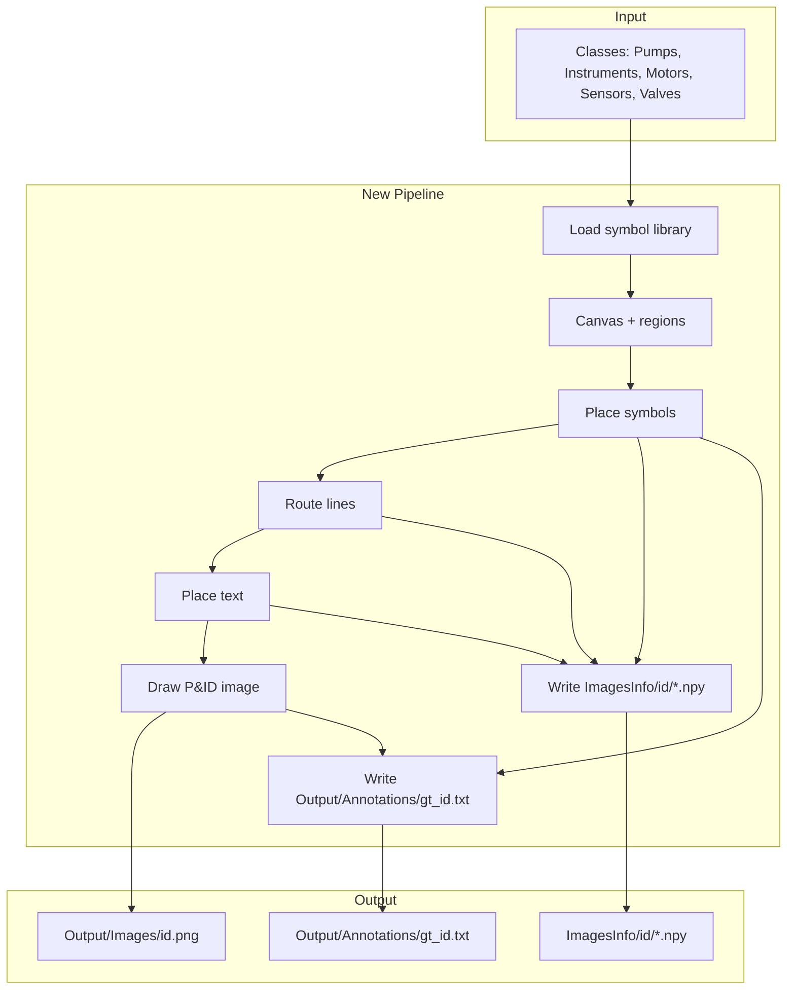

# DigitizePID Generator — Option A Plan

**Scope:** New DigitizePID-native pipeline (no reuse of existing schematic generators). Uses [DigitizePID_Dataset/Classes/](DigitizePID_Dataset/Classes/) as symbol source and produces your target directory layout plus ICDAR-style annotations.

---

## 1. Target directory structure

All paths are under `DigitizePID_Dataset/` (or a configurable root you pass to the script).

```
DigitizePID_Dataset/
├── Classes/                          # INPUT (you already have this)
│   ├── Pumps/
│   ├── Instruments/
│   ├── Motors/
│   ├── Sensors/
│   └── Valves/
├── ImagesInfo/                       # OUTPUT — rich .npy annotations per image
│   ├── 0/
│   │   ├── 0_symbols.npy
│   │   ├── 0_lines.npy
│   │   ├── 0_lines2.npy
│   │   ├── 0_words.npy
│   │   ├── 0_linker.npy
│   │   ├── 0_KeyValue.npy
│   │   └── 0_Table.npy
│   ├── 1/
│   │   └── ...
│   └── ...
└── Output/                          # OUTPUT — images and ICDAR annotations
    ├── Images/
    │   ├── 0.png
    │   ├── 1.png
    │   └── ...
    └── Annotations/
        ├── gt_0.txt
        ├── gt_1.txt
        └── ...
```

**Annotation format (gt_*.txt):** One line per symbol, ICDAR-style:

`x1,y1,x2,y2,x3,y3,x4,y4,SymbolName`

- Four corners as 8 integers: top-left, top-right, bottom-right, bottom-left (or consistent winding you use today).
- **SymbolName** = filename stem of the symbol image (e.g. `Transducer`, `V-cone_Meter`, `Level_Controller`). Same convention as your current [output/annotations/gt_schematic_001.txt](output/annotations/gt_schematic_001.txt).

---

## 2. Symbol source: Classes/

- **Path:** `DigitizePID_Dataset/Classes/`
- **Subfolders:** Pumps, Instruments, Motors, Sensors, Valves (and any others you add later).
- **Files:** `*.png` per class. Stem = symbol name used in gt_*.txt and in `.npy` (e.g. `Analyzer_Transmitter`, `Flow_Controller`).

The pipeline will:

- Discover all `Classes/<category>/*.png`.
- Map `(category, stem)` → unique symbol type for placement and for assigning class ids in `.npy` if needed.
- Use stem as the **SymbolName** in `Output/Annotations/gt_{id}.txt`.

---

## 3. New pipeline architecture (Option A)

Build a single orchestrator (e.g. `generate_digitizepid.py`) that:

1. **Load symbol library** from `Classes/` (all categories, all PNGs).
2. **Define canvas** (e.g. 7168×4561 or configurable) and regions: main diagram, notes block, title block.
3. **Place symbols** in the main diagram with collision avoidance and optional rotation.
4. **Route lines** (pipes) between symbols; assign specs (e.g. `"2\"-XX-NNNN"`) and style (solid/dashed).
5. **Place text** (tags, line specs, notes, title-block fields) and record word bboxes.
6. **Draw** the full P&amp;ID (lines, symbols, text, notes, title block) → `Output/Images/{id}.png`.
7. **Build and write**:
   - **ImagesInfo/{id}/*.npy** (symbols, lines, lines2, words, linker, KeyValue, Table),
   - **Output/Annotations/gt_{id}.txt** (ICDAR: 8 coords + SymbolName per symbol).

Data flow:



---

## 4. Implementation blocks

### 4.1 Symbol loader

- Scan `Classes/<category>/*.png`, load as numpy/cv2 (RGB or grayscale as needed).
- Return list of `(image, symbol_name, category)` where `symbol_name` is the stem (e.g. `Flow_Controller`).
- Optional: assign a numeric class id per (category, name) for `.npy` and future segmentation.

### 4.2 Canvas and regions

- Fixed or configurable (W, H). Example: 7168×4561.
- Define rectangles: **main diagram** (e.g. left 70%), **notes** (top-right), **title block** (bottom-right).
- All coordinates in pixel space of the final image.

### 4.3 Placement

- Sample symbols from the library (with category weighting if desired).
- Place in the main diagram with random position and optional rotation; enforce no overlap (e.g. via bounding boxes + padding).
- Record for each symbol: bbox (x1,y1,x2,y2), four-point polygon (for ICDAR), symbol_name, category, and id (`symbol_1`, `symbol_2`, …).

### 4.4 Line routing

- Decide which symbol pairs to connect (e.g. by proximity, or random graph).
- For each pair, generate polyline segments (orthogonal or Manhattan-style) and avoid crossing symbols.
- For each segment store: `[x1,y1,x2,y2]`, spec string (e.g. `"2\"-AB-1234"`), style in `{solid, dashed}`.
- Assign line ids (`line_1`, …). Build **linker**: for each symbol, list of line ids and word ids attached to it.

### 4.5 Text placement

- Per symbol: place a **tag** (e.g. `CD-19761`) near the symbol; record bbox and text → **words**.
- Per line (or segment): optional **line spec** label; record bbox and text → **words**.
- Notes and title block: fill from templates; record word bboxes if you need them in `words.npy`.

### 4.6 Drawing

- Render lines (solid/dashed, thickness), then symbols (paste scaled/rotated PNGs), then text.
- Write result to `Output/Images/{id}.png`.

### 4.7 ImagesInfo/*.npy writer

Produce the same schemas as in your reference samples:

| File | Content |
|------|--------|
| `{id}_symbols.npy` | (N, 3) object: `[symbol_id, bbox [x1,y1,x2,y2], class_id]` — class_id can be numeric or string (e.g. stem or id 1–K). |
| `{id}_words.npy` | (M, 4) object: `[word_id, bbox, text, flags]`. |
| `{id}_lines.npy` | (L, 4) object: `[line_id, [x1,y1,x2,y2], spec, style]`. |
| `{id}_lines2.npy` | (L2, 5) int64: `[x1,y1,x2,y2, type]` derived from line segments (e.g. type=0/1 for dashed/solid). |
| `{id}_linker.npy` | (N, 2) object: `[symbol_id, list of "word_*" and "line_*" ids]`. |
| `{id}_KeyValue.npy` | (10, 2) str: fixed keys, values from config/templates. |
| `{id}_Table.npy` | (5, 6) str: revision table header + 4 rows. |

Use 1-based string ids: `symbol_1`, `word_1`, `line_1`, etc.

### 4.8 Output/Annotations/gt_{id}.txt writer

- One line per placed symbol: `x1,y1,x2,y2,x3,y3,x4,y4,SymbolName`
- `(x1,y1)...(x4,y4)` = four corners (e.g. TL, TR, BR, BL) from placement.
- **SymbolName** = symbol stem from Classes (e.g. `Transducer`, `V-cone_Meter`).

---

## 5. Suggested default structure (small tweak)

Your layout is clear; one optional refinement:

- **IDs:** Use integer ids `0, 1, 2, ...` consistently: `Output/Images/0.png`, `Output/Annotations/gt_0.txt`, `ImagesInfo/0/`. This keeps filenames simple and aligned. You already used this in your example.

If you prefer zero-padded names (e.g. `000.png`, `gt_000.txt`, `000/`) for sorting, add a format like `id_str = f"{id:03d}"` and use that in all output paths.

---

## 6. Deliverables

| Deliverable | Description |
|-------------|-------------|
| **`generate_digitizepid.py`** | Main script: loads Classes, runs layout/place/route/text/draw, writes ImagesInfo, Output/Images, Output/Annotations. |
| **Config** | Root path, canvas size, number of images, random seed, paths for Classes / ImagesInfo / Output (or derived from root). |
| **Symbol loader** | Reads `Classes/{Pumps,Instruments,Motors,Sensors,Valves,...}/*.png`, exposes (image, symbol_name, category). |
| **Placement** | Grid or random placement with collision check; outputs symbol list with bbox, polygon, name, id. |
| **Line routing** | Connects symbol pairs with orthogonal segments; outputs segment list + spec + style; builds linker. |
| **Text** | Tags and optional line specs; optional notes/title-block text; word bboxes for .npy. |
| **Renderer** | Draws lines, symbols, text → PNG. |
| **Writers** | ImagesInfo (all 7 .npy) and Output/Annotations (gt_*.txt in ICDAR form). |

---

## 7. Order of implementation

1. **Config + paths** — root, Classes, ImagesInfo, Output; canvas size; num_images.
2. **Symbol loader** — from `Classes/`; (image, symbol_name, category).
3. **Canvas + placement** — regions; place symbols; compute bbox + 4-point polygon; collision check.
4. **gt_*.txt writer** — from placed symbols (polygon + SymbolName) → `Output/Annotations/gt_{id}.txt`.
5. **Line routing** — connect pairs; segments + spec + style; linker symbol ↔ lines.
6. **Text** — tags and line specs; word bboxes.
7. **Renderer** — draw and save `Output/Images/{id}.png`.
8. **ImagesInfo writer** — symbols, lines, lines2, words, linker, KeyValue, Table → `ImagesInfo/{id}/*.npy`.
9. **Integration** — end-to-end run; optional title block + notes templates.
10. **Tuning** — layout, density, line style, text size so images look good and annotations stay correct.

This plan keeps your desired directory structure, uses Option A only, and targets good images plus ICDAR-style annotations in `Output/Annotations/gt_{id}.txt`.
